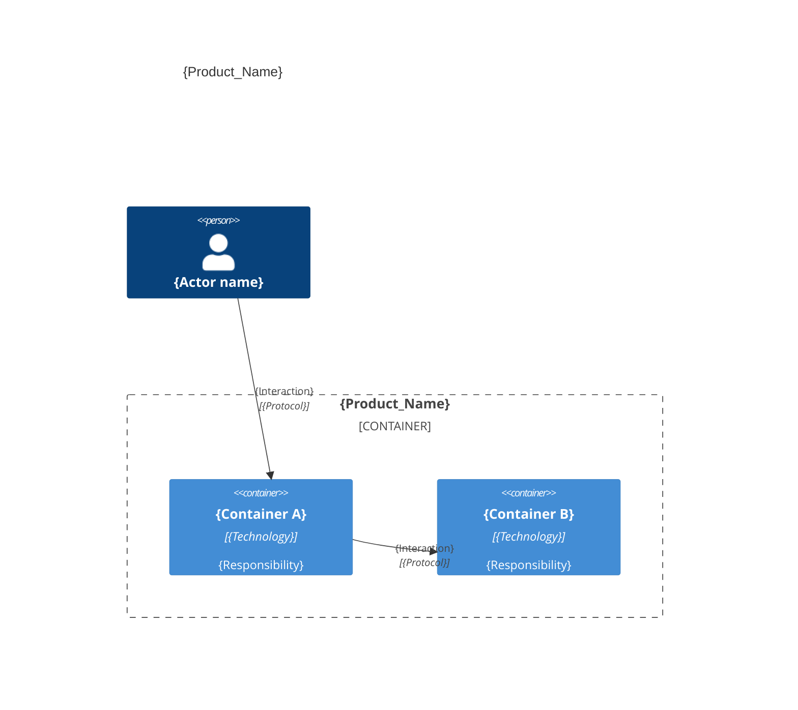
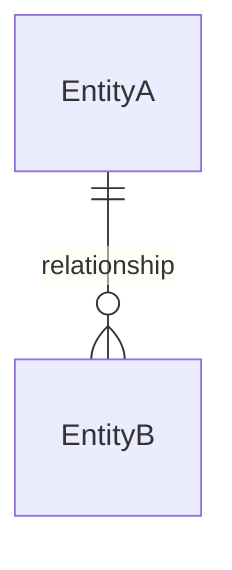

# Architecture — {Product_Name}

## Overview

{One paragraph: what the system does, who uses it, and the main technology.}

---

## Containers & components

{One C4 diagram. For a tiny project, show containers; nest the few key components inside.}



### Containers table
| Container | Technology | Responsibility |
|-----------|------------|----------------|
| [{Container_Name}](./{container_name}.arch.md) | {Technology} | {Responsibility} |

<example>
| Container | Technology | Responsibility |
|-----------|------------|----------------|
| [db](./db.arch.md) | PostgreSQL | Database |
| [api](./api.arch.md) | Java Spring Boot | API |
| [web](./web.arch.md) | React | Web application |
| [mobile](./mobile.arch.md) | React Native | Mobile application |
| [desktop](./desktop.arch.md) | Electron | Desktop application |
| [cli](./cli.arch.md) | CLI | Command line interface |
| [e2e](./e2e.arch.md) | Playwright | End-to-end tests |
</example>

### Code organization

**Pattern**: {Layer-based | Feature-based | Hybrid}.

```text
{source_root}/
├── {folder_or_file}    # {one-line responsibility}
└── {folder_or_file}    # {one-line responsibility}
```

### Key contracts

| Contract | Shape | Used by |
|----------|-------|---------|
| {name} | {signature / route / schema} | {consumer} |

---

## Domain entities

{Entities and relationships — no attributes here.}



> last updated: {Date}
