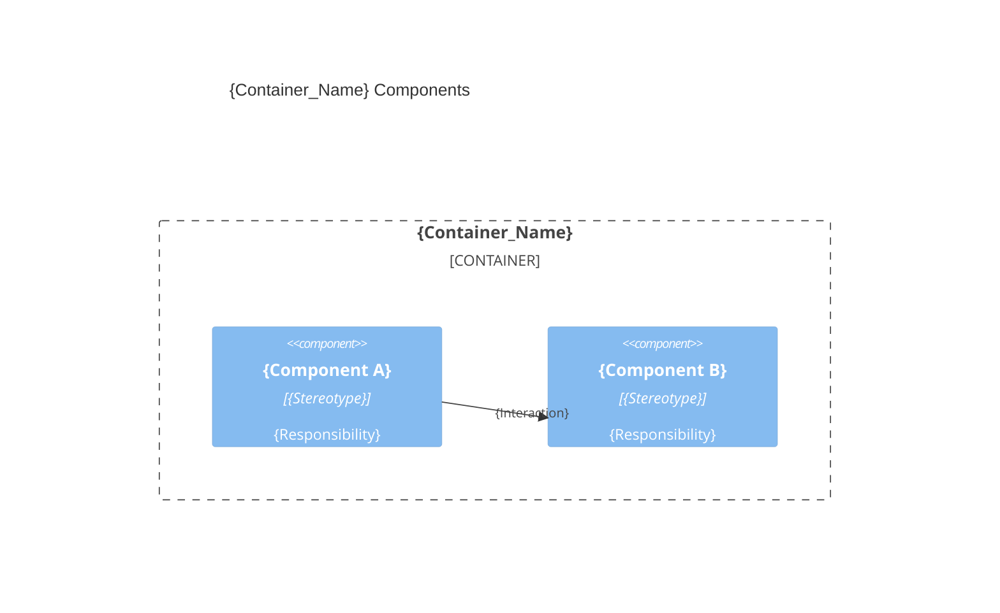

# {Container_Name} architecture — {Product_Name}

> Container `{container}` from [`system.arch.md`](./system.arch.md). Tier: `{back | front | fullstack | e2e | db}`.

## Overview

{One paragraph: this container's responsibility and main technology.}

- **Folder**: `{source_root}/`
- **Archetype**: {language} — {framework}
- **Talks to**: {sibling containers / external systems it depends on}

---

## Components diagram (C4 L3)



### Code organization

**Pattern**: {Layer-based | Feature-based | Hybrid}.

```text
{source_root}/
├── {folder_or_file}    # {one-line responsibility}
└── {folder_or_file}    # {one-line responsibility}
```

### Key contracts

{Routes, interfaces, or events this container exposes or consumes. Short table.}

| Contract | Shape | Direction |
|----------|-------|-----------|
| {name} | {signature / route / schema} | {exposes \| consumes} |

---

## Data Schemas

{If this is a database container, list the tables and their key fields.}


{If this is a api container, list the api endpoints and DAOs interfaces.}
> last updated: {Date}
