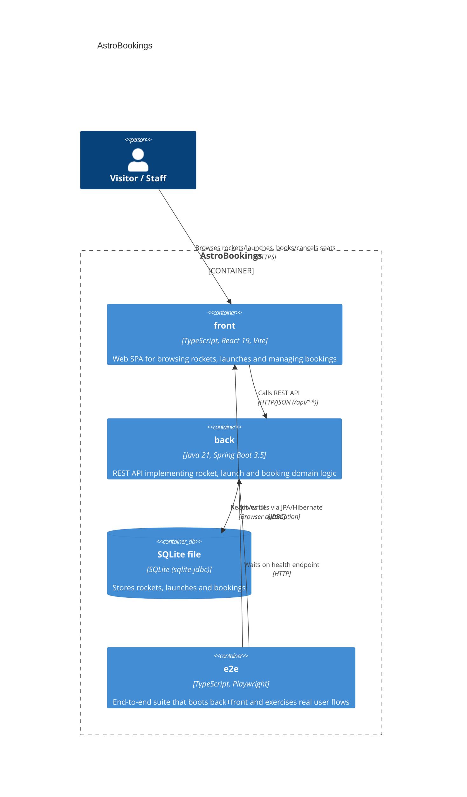
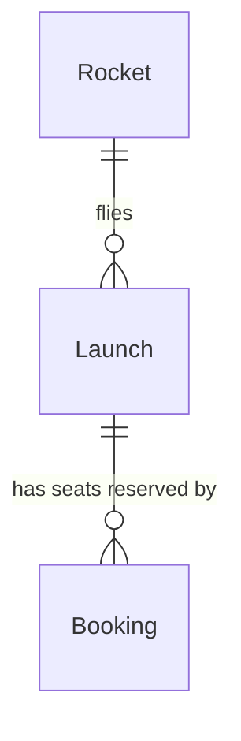

# Architecture — AstroBookings

## Overview

AstroBookings is a fictional space tourism company app that manages rockets, launches, and passenger bookings. Visitors browse launches and book a seat with their contact details; staff maintain the rocket fleet and schedule launches. The system is a classic three-container web app: a Java/Spring Boot REST API backed by SQLite, a React single-page application consumed by visitors, and a Playwright end-to-end test suite that drives both through a real browser.

---

## Containers & components



### Containers table
| Container | Technology | Responsibility |
|-----------|------------|----------------|
| [back](../back) — [deep dive](./arch/back.arch.md) | Java 21, Spring Boot 3.5 (Web, Data JPA), SQLite via sqlite-jdbc + hibernate-community-dialects, Maven | REST API for rockets, launches, bookings and health; owns the domain model and persistence |
| [front](../front) — [deep dive](./arch/front.arch.md) | TypeScript, React 19, Vite, Vitest + Testing Library | Single-page application for visitors/staff to view rockets, launches and manage bookings |
| [e2e](../e2e) — [deep dive](./arch/e2e.arch.md) | TypeScript, Playwright | End-to-end tests that boot `back` and `front` together and verify full-stack flows |

### Code organization

**Pattern**: Feature-based (per container).

```text
back/src/main/java/dev/aiddbot/abjavareact/
├── booking/    # Booking entity, controller, service, repository, DTOs — booking lifecycle (CREATED/CANCELLED)
├── launch/     # Launch entity, controller, service, repository, DTOs — launch scheduling
├── rocket/     # Rocket entity, controller, service, repository, DTOs — fleet maintenance
├── health/     # Health check entity/controller/service — liveness endpoint
└── shared/     # Cross-cutting config (CorsConfig)

front/src/
├── features/bookings/   # BookingList, bookingsApi, useBookings hook (+tests)
├── features/launches/   # LaunchList, launchesApi, useLaunches hook (+tests)
├── features/rockets/    # RocketList, rocketsApi, useRockets hook (+tests)
├── features/health/     # HealthStatus, healthApi, useHealth hook (+tests)
├── shared/api/          # httpClient (fetch wrapper: get/post/put/del)
└── shared/types/        # TypeScript types mirroring backend DTOs

e2e/
├── tests/      # booking.spec.ts, health.spec.ts — Playwright specs
└── pages/      # BookingsPage.ts, HealthPage.ts — page objects
```

### Key contracts

| Contract | Shape | Used by |
|----------|-------|---------|
| `GET/POST /api/bookings`, `POST /api/bookings/{id}/cancel` | JSON (`BookingRequest`/`BookingResponse`) | front (`bookingsApi.ts`), e2e |
| `GET/POST /api/launches` (+ CRUD) | JSON (`LaunchRequest`/`LaunchResponse`) | front (`launchesApi.ts`) |
| `GET/POST /api/rockets` (+ CRUD) | JSON (`RocketRequest`/`RocketResponse`) | front (`rocketsApi.ts`) |
| `GET /api/health` | JSON (`HealthResponse`) | front (`healthApi.ts`), e2e (Playwright `webServer.url` readiness check) |
| `httpClient` (`get`/`post`/`put`/`del`) | `fetch`-based wrapper, `VITE_API_BASE_URL` prefixed | all front feature `*Api.ts` modules |

---

## Domain entities



> last updated: 2026-07-02
