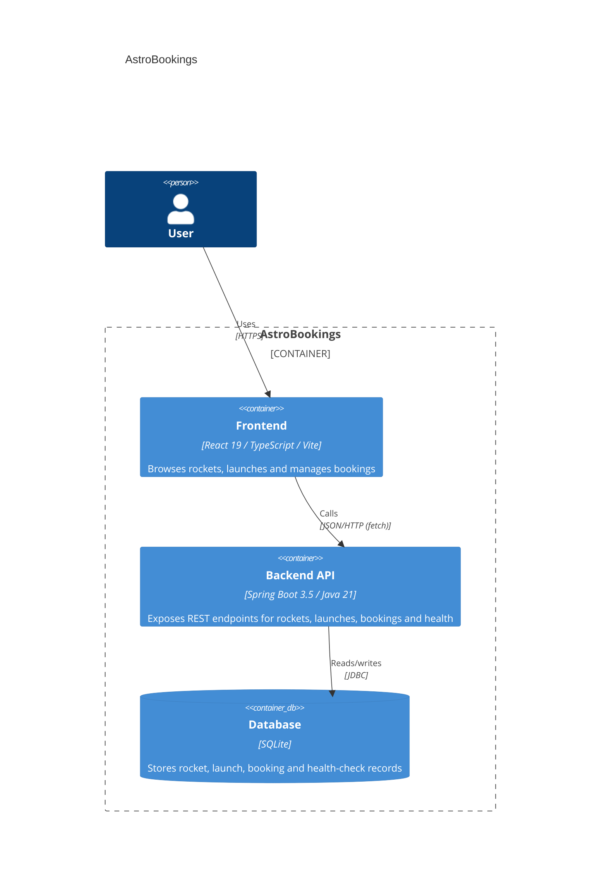
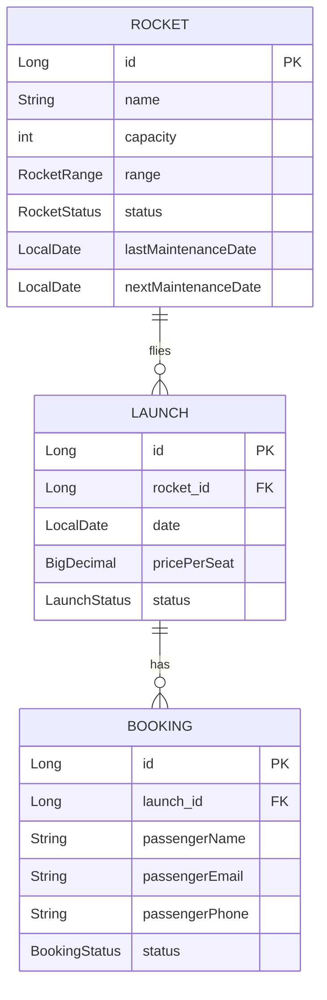

# Architecture — AstroBookings

## Overview

AstroBookings is a fictional space tourism company app that manages rockets, launches, and bookings. A single, unauthenticated user browses rockets and launches and creates passenger bookings through a React single-page app, which talks over JSON/HTTP to a Spring Boot REST API backed by a SQLite database.

---

## Containers & components



### Code organization

**Pattern**: Feature-based (mirrored on both backend and frontend).

```text
back/src/main/java/dev/aiddbot/abjavareact/
├── rocket/      # Rocket entity, repository, service, controller, DTOs
├── launch/      # Launch entity, repository, service, controller, DTOs
├── booking/     # Booking entity, repository, service, controller, DTOs
├── health/      # Health-check entity, repository, service, controller
└── shared/      # Cross-cutting config (CorsConfig)
```

```text
front/src/
├── features/
│   ├── rockets/     # RocketList, rocketsApi, useRockets hook
│   ├── launches/    # LaunchList, launchesApi, useLaunches hook
│   ├── bookings/     # BookingList, bookingsApi, useBookings hook
│   └── health/      # HealthStatus, healthApi, useHealth hook
└── shared/
    ├── api/         # httpClient (fetch wrapper)
    └── types/       # Shared DTO types per domain
```

### Key contracts

| Contract | Shape | Used by |
|----------|-------|---------|
| `GET /api/rockets`, `GET /api/rockets/{id}` | Returns `RocketResponse` / `RocketResponse[]` | `rocketsApi.ts` |
| `POST /api/rockets`, `PUT /api/rockets/{id}` | Accepts `RocketRequest`, returns `RocketResponse` | `rocketsApi.ts` |
| `DELETE /api/rockets/{id}` | `204 No Content` | `rocketsApi.ts` |
| `GET /api/launches`, `POST /api/launches`, `PUT /api/launches/{id}` | `LaunchRequest` / `LaunchResponse` | `launchesApi.ts` |
| `GET /api/bookings`, `POST /api/bookings` | `BookingRequest` / `BookingResponse`, `400` on missing passenger data | `bookingsApi.ts` |
| `POST /api/bookings/{id}/cancel` | Returns `BookingResponse` with status `CANCELLED`, `404` if missing | `bookingsApi.ts` |
| `GET /api/health` | `HealthResponse` (`200` UP / `503` otherwise) | `healthApi.ts` |

---

## Domain entities



### Rocket

| Field | Type | Constraints |
|-------|------|-------------|
| `id` | Long | PK, identity |
| `name` | String | required |
| `capacity` | int | required |
| `range` | RocketRange | required — `EARTH`, `MOON`, `MARS` |
| `status` | RocketStatus | required — `ACTIVE`, `MAINTENANCE`, `RETIRED` |
| `lastMaintenanceDate` | LocalDate | optional |
| `nextMaintenanceDate` | LocalDate | optional |

### Launch

| Field | Type | Constraints |
|-------|------|-------------|
| `id` | Long | PK, identity |
| `rocket` | Rocket | FK → Rocket, required |
| `date` | LocalDate | required, expected in the future |
| `pricePerSeat` | BigDecimal | required |
| `status` | LaunchStatus | required — `CREATED`, `CONFIRMED`, `CANCELLED`, `COMPLETED` |

### Booking

| Field | Type | Constraints |
|-------|------|-------------|
| `id` | Long | PK, identity |
| `launch` | Launch | FK → Launch, required |
| `passengerName` | String | required |
| `passengerEmail` | String | required |
| `passengerPhone` | String | required |
| `status` | BookingStatus | required — `CREATED`, `CANCELLED`; not client-supplied, always starts `CREATED` |

**Rules**: A Launch must reference an existing Rocket; a Booking must reference an existing Launch. Booking creation requires non-empty `passengerName`/`passengerEmail`/`passengerPhone` (`400` otherwise). Booking lifecycle is one-directional: `CREATED` → `CANCELLED` only, via `POST /api/bookings/{id}/cancel` — no generic update or delete. No authentication or user identity is modeled — out of scope per spec.

> last updated: 2026-06-30
