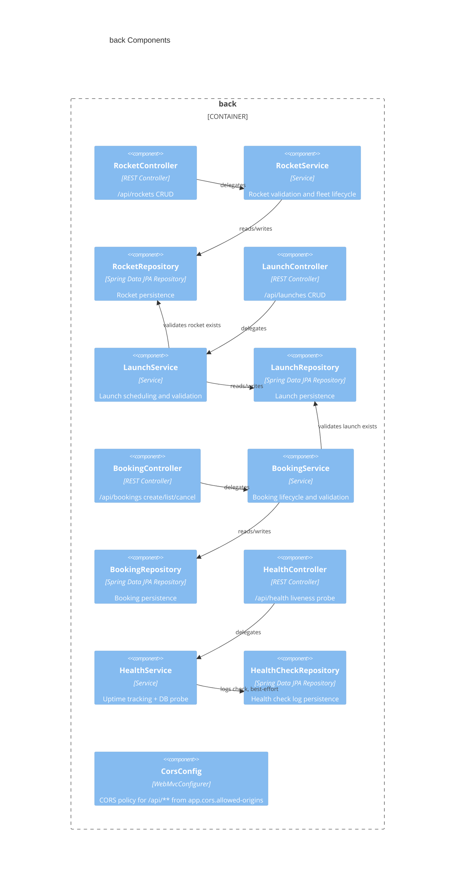

# back architecture — AstroBookings

> Container `back` from [`arch.md`](../arch.md). Tier: `back`.

## Overview

`back` is the REST API for AstroBookings: it owns the rocket, launch, booking and health domain logic and persists them to a SQLite file. It is a single Spring Boot 3.5 application with one feature package per bounded concern (`rocket`, `launch`, `booking`, `health`), each following the identical Controller → Service → Repository → Entity layering, plus a `shared` package for cross-cutting config.

- **Folder**: `back/`
- **Archetype**: Java 21 — Spring Boot 3.5 (Web, Data JPA), SQLite via `sqlite-jdbc` + `hibernate-community-dialects`, Maven
- **Talks to**: `db` (SQLite file `data/app.db`) via JPA/Hibernate (JDBC); consumed by `front` over HTTP/JSON on `/api/**`; exercised by `e2e` over HTTP (health readiness + full flows)

---

## Components diagram (C4 L3)



### Code organization

**Pattern**: Feature-based, each feature internally layer-based (Controller → Service → Repository → Entity + Request/Response records + Status enum).

```text
back/src/main/java/dev/aiddbot/abjavareact/
├── AbJavaReactApplication.java   # @SpringBootApplication entry point; provisions data/ dir before boot
├── booking/
│   ├── Booking.java              # @Entity — passenger reservation, ManyToOne Launch, cancel() lifecycle method
│   ├── BookingController.java    # @RestController /api/bookings — findAll/findById/create/cancel
│   ├── BookingService.java       # validate → resolve Launch → persist → map to response
│   ├── BookingRepository.java    # JpaRepository<Booking, Long>, no custom queries
│   ├── BookingRequest.java       # record: launchId, passengerName, passengerEmail, passengerPhone
│   ├── BookingResponse.java      # record: flattens launch's rocketName/date alongside passenger + status
│   └── BookingStatus.java        # enum CREATED, CANCELLED
├── launch/
│   ├── Launch.java                # @Entity — ManyToOne Rocket, date, pricePerSeat, status; has setters (mutable via PUT)
│   ├── LaunchController.java      # @RestController /api/launches — full CRUD
│   ├── LaunchService.java         # validate → resolve Rocket → persist/update/delete → map to response
│   ├── LaunchRepository.java      # JpaRepository<Launch, Long>
│   ├── LaunchRequest.java         # record: rocketId, date, pricePerSeat, status
│   ├── LaunchResponse.java        # record: flattens rocket's name alongside launch fields
│   └── LaunchStatus.java          # enum CREATED, CONFIRMED, CANCELLED, COMPLETED
├── rocket/
│   ├── Rocket.java                 # @Entity — fleet aircraft, setters (mutable via PUT)
│   ├── RocketController.java       # @RestController /api/rockets — full CRUD
│   ├── RocketService.java          # validate → persist/update/delete → map to response
│   ├── RocketRepository.java       # JpaRepository<Rocket, Long>
│   ├── RocketRequest.java          # record: name, capacity, range, status, maintenance dates
│   ├── RocketResponse.java         # record mirrors entity fields
│   ├── RocketRange.java            # enum EARTH, MOON, MARS
│   └── RocketStatus.java           # enum ACTIVE, MAINTENANCE, RETIRED
├── health/
│   ├── HealthCheck.java            # @Entity — persisted log of each liveness probe
│   ├── HealthController.java       # @RestController /api/health — 200 if UP else 503
│   ├── HealthService.java          # probes DB via repository.count(), tracks uptime since boot, persists quietly
│   ├── HealthCheckRepository.java  # JpaRepository<HealthCheck, Long>
│   └── HealthResponse.java         # record with nested Uptime record
└── shared/
    └── CorsConfig.java             # @Configuration WebMvcConfigurer — allows configured origins on /api/**
```

### Key contracts

| Contract | Shape | Direction |
|----------|-------|-----------|
| `GET /api/rockets`, `GET /api/rockets/{id}`, `POST /api/rockets`, `PUT /api/rockets/{id}`, `DELETE /api/rockets/{id}` | JSON `RocketRequest` in, `RocketResponse` out | exposes |
| `GET /api/launches`, `GET /api/launches/{id}`, `POST /api/launches`, `PUT /api/launches/{id}`, `DELETE /api/launches/{id}` | JSON `LaunchRequest` in, `LaunchResponse` out | exposes |
| `GET /api/bookings`, `GET /api/bookings/{id}`, `POST /api/bookings`, `POST /api/bookings/{id}/cancel` | JSON `BookingRequest` in, `BookingResponse` out | exposes |
| `GET /api/health` | JSON `HealthResponse` (`status`, `databaseStatus`, `uptime`, `checkedAt`); 200 if `UP`, 503 if `DOWN` | exposes |
| `RocketRepository` / `LaunchRepository` / `BookingRepository` / `HealthCheckRepository` | `JpaRepository<Entity, Long>` | consumes (JDBC → SQLite) |

---

## Data Schemas

### Entities (JPA, table names in parens)

| Entity | Table | Key fields | Relations |
|--------|-------|------------|-----------|
| `Rocket` | `rocket` | `id`, `name`, `capacity`, `range` (enum: EARTH/MOON/MARS), `status` (enum: ACTIVE/MAINTENANCE/RETIRED), `lastMaintenanceDate`, `nextMaintenanceDate` | referenced by `Launch` |
| `Launch` | `launch` | `id`, `date`, `pricePerSeat` (BigDecimal), `status` (enum: CREATED/CONFIRMED/CANCELLED/COMPLETED) | `ManyToOne Rocket` (EAGER, `rocket_id`, not null); referenced by `Booking` |
| `Booking` | `booking` | `id`, `passengerName`, `passengerEmail`, `passengerPhone`, `status` (enum: CREATED/CANCELLED) | `ManyToOne Launch` (EAGER, `launch_id`, not null) |
| `HealthCheck` | `health_check` | `id`, `status`, `databaseStatus`, `uptimeSeconds`, `checkedAt` | none (append-only probe log) |

### DAOs (Spring Data JPA repositories)

- `RocketRepository extends JpaRepository<Rocket, Long>`
- `LaunchRepository extends JpaRepository<Launch, Long>`
- `BookingRepository extends JpaRepository<Booking, Long>`
- `HealthCheckRepository extends JpaRepository<HealthCheck, Long>`

All four are marker interfaces with no custom query methods; Hibernate DDL is `update` mode (`spring.jpa.hibernate.ddl-auto=update`) against `data/app.db`.

> last updated: 2026-07-02
