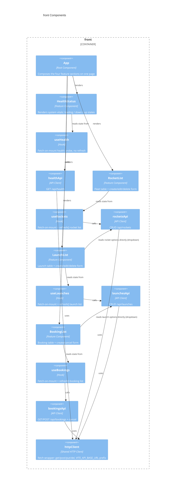

# front architecture — AstroBookings

> Container `front` from [`arch.md`](../arch.md). Tier: `front`.

## Overview

`front` is the visitor/staff-facing single-page application for AstroBookings: it lists rockets, launches and bookings, and lets users create/update/delete rockets and launches and create/cancel bookings. It is a React 19 + Vite app organized by feature (`health`, `rockets`, `launches`, `bookings`), each feature repeating the identical Component → Hook → API-client layering on top of one shared `fetch` wrapper.

- **Folder**: `front/`
- **Archetype**: TypeScript — React 19, Vite 8, Vitest + Testing Library
- **Talks to**: `back` REST API over HTTP/JSON (base URL from `VITE_API_BASE_URL`, endpoints under `/api/**`); driven by `e2e` (Playwright) as the browser UI under test

---

## Components diagram (C4 L3)



### Code organization

**Pattern**: Feature-based, each feature internally layered (Component → Hook → API client), plus a `shared/` module for cross-feature concerns.

```text
front/src/
├── main.tsx                    # createRoot entry point, mounts <App /> in <StrictMode>
├── App.tsx                     # Root component: renders HealthStatus, RocketList, LaunchList, BookingList in order
├── App.css, index.css          # App shell / global styles
├── assets/hero.png             # Static asset
├── features/
│   ├── health/
│   │   ├── HealthStatus.tsx        # loading / error / up-down render, no form (read-only feature)
│   │   ├── HealthStatus.css
│   │   ├── HealthStatus.test.tsx
│   │   ├── useHealth.ts            # fetch-on-mount only (no refreshKey — nothing mutates health)
│   │   ├── useHealth.test.ts
│   │   └── healthApi.ts            # GET only
│   ├── rockets/
│   │   ├── RocketList.tsx          # table + create/edit/delete form, own FormState
│   │   ├── RocketList.css
│   │   ├── RocketList.test.tsx
│   │   ├── useRockets.ts           # fetch-on-mount + refresh() via refreshKey
│   │   ├── useRockets.test.ts
│   │   ├── rocketsApi.ts           # full CRUD (get, getById, create, update, delete)
│   │   └── rocketsApi.test.ts
│   ├── launches/                   # same shape as rockets/; LaunchList also calls rocketsApi.getRockets()
│   │   └── (LaunchList.tsx, useLaunches.ts, launchesApi.ts + .css/.test siblings)
│       LaunchList reads rocketsApi.getRockets() directly in a local useEffect to populate the rocket <select>
│   └── bookings/                   # same shape, no update/delete — only create + cancel
│       ├── BookingList.tsx         # table + create form; calls launchesApi.getLaunches() directly for the launch <select>; NO colocated BookingList.test.tsx (gap — see rules doc)
│       ├── BookingList.css
│       ├── useBookings.ts
│       ├── useBookings.test.ts
│       ├── bookingsApi.ts          # get, getById, create, cancel (no update/delete)
│       └── bookingsApi.test.ts
├── shared/
│   ├── api/httpClient.ts       # single fetch wrapper: get/post/put/del, VITE_API_BASE_URL prefix, throws Error on !response.ok
│   └── types/
│       ├── health.ts           # Status, HealthResponse
│       ├── rocket.ts           # Rocket, RocketStatus, RocketRange, RocketRequest = Omit<Rocket,'id'>
│       ├── launch.ts           # Launch, LaunchStatus, LaunchRequest = Omit<Launch,'id'|'rocketName'>
│       └── booking.ts          # Booking, BookingStatus, BookingRequest = Omit<Booking,'id'|derived fields|'status'>
└── test/setup.ts               # Vitest setup: imports @testing-library/jest-dom
```

### Key contracts

| Contract | Shape | Direction |
|----------|-------|-----------|
| `httpClient.get/post/put/del` | `fetch`-based wrapper, `VITE_API_BASE_URL`-prefixed, throws `Error` on non-2xx | exposes (to all `*Api.ts` modules) |
| `healthApi.getHealth()` → `GET /api/health` | returns `HealthResponse` | consumes (backend) |
| `rocketsApi.{getRockets,getRocketById,createRocket,updateRocket,deleteRocket}` → `/api/rockets` | `RocketRequest` in, `Rocket`/`Rocket[]` out | consumes (backend); also consumed directly by `LaunchList` for its rocket dropdown |
| `launchesApi.{getLaunches,getLaunchById,createLaunch,updateLaunch,deleteLaunch}` → `/api/launches` | `LaunchRequest` in, `Launch`/`Launch[]` out | consumes (backend); also consumed directly by `BookingList` for its launch dropdown |
| `bookingsApi.{getBookings,getBookingById,createBooking,cancelBooking}` → `/api/bookings`, `/api/bookings/{id}/cancel` | `BookingRequest` in, `Booking`/`Booking[]` out | consumes (backend) |
| `use{Feature}()` hooks | `{ data, error, isLoading, refresh? }` object, `as const` | exposes (to feature components) |

---

## Data Schemas

Not applicable (no database) — this container consumes the `back` REST API. The client-side type contracts mirroring the backend's Request/Response DTOs live in `src/shared/types/`:

| Type module | Entity type | Derived request type | Notes |
|-------------|-------------|-----------------------|-------|
| `health.ts` | `HealthResponse` | — (read-only) | `status`/`database`: `'UP' \| 'DOWN'` |
| `rocket.ts` | `Rocket` | `RocketRequest = Omit<Rocket, 'id'>` | `range`: `'EARTH'\|'MOON'\|'MARS'`; `status`: `'ACTIVE'\|'MAINTENANCE'\|'RETIRED'` |
| `launch.ts` | `Launch` | `LaunchRequest = Omit<Launch, 'id'\|'rocketName'>` | `status`: `'CREATED'\|'CONFIRMED'\|'CANCELLED'\|'COMPLETED'`; carries raw `rocketId` FK |
| `booking.ts` | `Booking` | `BookingRequest = Omit<Booking, 'id'\|'launchRocketName'\|'launchDate'\|'status'>` | `status`: `'CREATED'\|'CANCELLED'`; carries raw `launchId` FK |

> last updated: 2026-07-02
