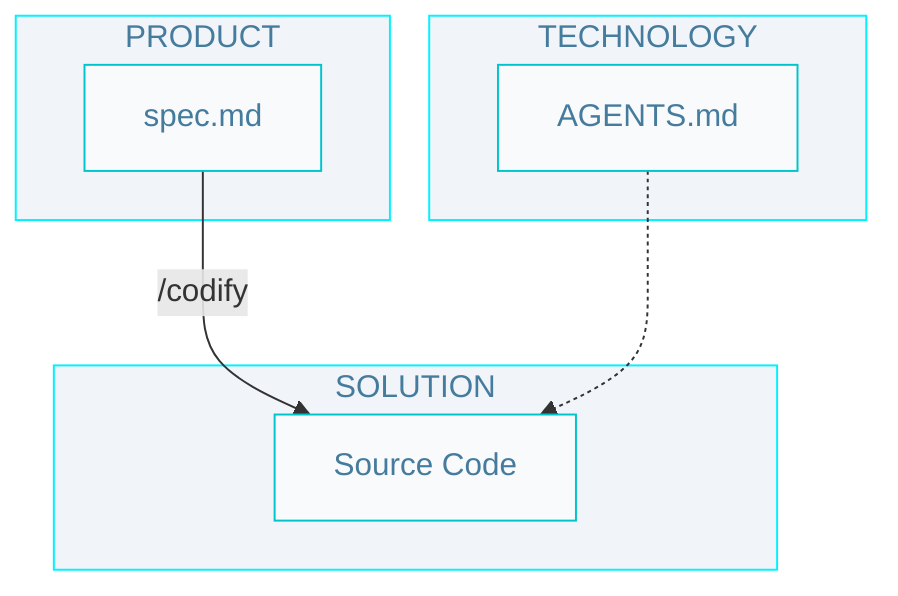

# Level 1 SDD workflow

## Commands

- `/codify` - Run the implementation cycle for one specification: generate plans, produce code, and validate with tests.

## Artifacts

### Technology

- `/AGENTS.md` - The entry point for any agent joining the project; defines how agents should operate, including rules, workflows, and artifact conventions.

- `rules/` - Define rules that agents must follow when writing code.

- `skills/` - Teach your agent how to do things. Make them easy to know when to use.

### Product

- `spec.md` - A detailed specification (problem, solution, verification) of a feature or technical requirement.

### Solution

- `Source Code` - The implementation of the system, including unit tests.
